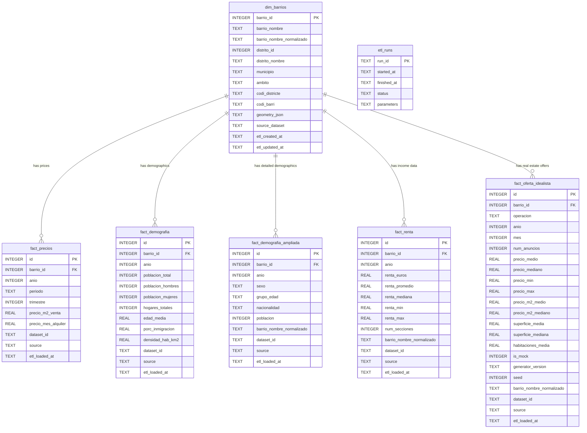

# Database Schema Documentation

This document details the database schema for the Barcelona Housing Demographics Analyzer. The database is implemented in SQLite and follows a star schema design with a central dimension table (`dim_barrios`) and multiple fact tables.

## Entity-Relationship Diagram (ERD)



## Table Descriptions

### `dim_barrios` (Dimension)
The central dimension table containing the 73 neighborhoods (barrios) of Barcelona. It serves as the primary key for linking all other fact tables.
- **Key Fields**: `barrio_id` (PK), `barrio_nombre`, `distrito_id`.
- **Geospatial**: Contains `geometry_json` for map visualizations.

### `fact_precios` (Fact)
Stores historical housing prices (sale and rent) aggregated by neighborhood and time period.
- **Purpose**: To track the evolution of housing costs over time.
- **Granularity**: One record per barrio, year, quarter (optional), and source dataset.
- **Unique Constraint**: `(barrio_id, anio, trimestre, dataset_id, source)` to allow multiple indicators from different sources to coexist without duplication.

### `fact_demografia` (Fact)
Standard demographic indicators aggregated at the neighborhood level.
- **Purpose**: Provides high-level population statistics like total population, gender breakdown, and density.
- **Granularity**: One record per barrio and year.

### `fact_demografia_ampliada` (Fact)
Detailed demographic breakdowns that allow for more granular analysis than `fact_demografia`.
- **Purpose**: Enables deep dives into population structure, such as analyzing specific age groups (e.g., "18-35 years") or nationality distribution within a neighborhood. This is crucial for correlating housing prices with specific demographic shifts (e.g., gentrification by young professionals).
- **Granularity**: One record per barrio, year, sex, age group, and nationality.

### `fact_renta` (Fact)
Economic indicators related to household income.
- **Purpose**: To analyze the purchasing power of neighborhoods.
- **Granularity**: One record per barrio and year.

### `fact_oferta_idealista` (Fact)
Real-time or near real-time supply data from Idealista API (or mock data when API unavailable).

#### Schema
```sql
CREATE TABLE fact_oferta_idealista (
    id INTEGER PRIMARY KEY AUTOINCREMENT,
    barrio_id INTEGER NOT NULL,
    operacion TEXT NOT NULL CHECK(operacion IN ('sale', 'rent')),
    anio INTEGER NOT NULL,
    mes INTEGER NOT NULL,
    num_anuncios INTEGER,
    precio_medio REAL,
    precio_mediano REAL,
    precio_min REAL,
    precio_max REAL,
    precio_m2_medio REAL,
    precio_m2_mediano REAL,
    superficie_media REAL,
    superficie_mediana REAL,
    habitaciones_media REAL,
    is_mock INTEGER DEFAULT 0,  -- Boolean: 1 = mock data, 0 = real API data
    generator_version TEXT,      -- Version of mock generator (if applicable)
    seed INTEGER,                -- Random seed for reproducibility (mock only)
    barrio_nombre_normalizado TEXT,
    dataset_id TEXT,
    source TEXT,                 -- 'idealista_api' or 'mock_generator'
    etl_loaded_at TEXT,
    FOREIGN KEY (barrio_id) REFERENCES dim_barrios(barrio_id)
);
```

#### Purpose
Captures the current market state (number of listings, median prices) which might differ from official statistics that often have a lag of 6-12 months.

#### Data Sources

**Production**: Idealista API (when credentials available)
- Endpoint: `/listings/search`
- Update Frequency: Weekly or on-demand
- Coverage: Active listings in Barcelona

**Development**: Mock Data Generator
- Script: `scripts/generate_mock_idealista.py`
- Coverage: All 73 barrios, last 12 months
- Generation Logic:
  - Base prices by district tier (Premium/Mid/Affordable)
  - Random variation (±10%) for realism
  - Sale/Rent ratio: ~200:1 (price_m2_sale / price_m2_rent)
  - Listings count: 10-150 (sale), 5-80 (rent)
- **Reproducibility**: Uses fixed seed (42) and version tagging

#### Mock Data Identification

The `is_mock` flag enables:
1. **UI Warnings**: Dashboard displays "⚠️ Datos Simulados" banner
2. **Data Filtering**: Analytics can exclude mock data if needed
3. **Testing**: Allows development without API credentials

```python
# Example: Check if data is mock
df = load_idealista_supply()
if df['is_mock'].any():
    st.warning("⚠️ Showing simulated data")
```

#### Regeneration

To regenerate mock data:
```bash
python scripts/generate_mock_idealista.py
```

This clears previous mock records (`source = 'mock_generator'`) and generates fresh data for the last 12 months.

#### Granularity
One record per barrio, operation type (sale/rent), year, and month.

### `etl_runs` (Audit)
Logs every execution of the ETL pipeline for auditing and debugging purposes.

## Data Quality Metrics

| Table | Completeness Target | Validity Target | Update Frequency |
|-------|---------------------|-----------------|------------------|
| `fact_precios` | ≥95% | ≥98% | Quarterly |
| `fact_demografia` | ≥95% | ≥98% | Annually |
| `fact_renta` | ≥90% | ≥98% | Annually |
| `fact_oferta_idealista` | ≥95% | ≥95% | Weekly (API) / On-demand (Mock) |

## Notes on Mock Data

### When to Use Mock Data
- **Development**: Building UI without API access
- **Testing**: Automated tests requiring predictable data
- **Demonstrations**: Showcasing features to stakeholders

### Limitations
- Mock data uses simplified pricing models
- Does not reflect real market dynamics
- Should NEVER be used for production analytics

### Transition to Real Data
1. Obtain Idealista API credentials
2. Update `src/data_extraction/idealista_scraper.py` with credentials
3. Run ETL pipeline with `--source=idealista_api`
4. Mock data will be automatically excluded (filter `is_mock = 0`)
