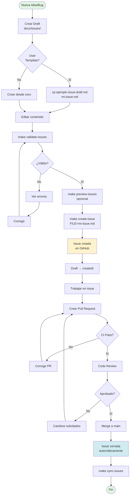

# 🔄 Flujo de Trabajo de Issues

Esta guía describe el flujo completo para crear, validar y gestionar issues en el proyecto.

## 📊 Diagrama de Flujo



## 🚀 Quick Start

### Opción 1: Usando Makefile (Recomendado)

```bash
# 1. Crear draft desde template
cp docs/issues/ejemplo-issue-draft.md docs/issues/fix-bug-validacion.md

# 2. Editar el draft
vim docs/issues/fix-bug-validacion.md

# 3. Validar localmente
make validate-issues

# 4. Preview (opcional, no crea la issue)
make preview-issues

# 5. Crear en GitHub
make create-issue FILE=fix-bug-validacion.md
```

### Opción 2: Scripts Directos

```bash
# Validar
python3 scripts/validate_issues.py docs/issues/fix-bug-validacion.md

# Crear issue
python3 scripts/create_issues_from_drafts.py docs/issues/fix-bug-validacion.md

# Batch (todas las issues del directorio)
python3 scripts/create_issues_from_drafts.py docs/issues/ --batch
```

## ✅ Checklist para Crear una Issue

Antes de crear la issue, asegúrate de que tu draft tiene:

- [ ] **Título descriptivo** con emoji y tipo (🐛 Bug, ✨ Feature, etc.)
- [ ] **Sección "Descripción"** clara y concisa
- [ ] **Archivos Afectados** listados con rutas exactas
- [ ] **Criterios de Aceptación** con checkboxes `- [ ]`
- [ ] **Estimación de tiempo** (formato: X horas/días)
- [ ] **Prioridad** clara (🔴 High, 🟡 Medium, 🟢 Low)
- [ ] **Labels apropiados** (bug, enhancement, etl, etc.)
- [ ] **Ejemplos de código** cuando aplique
- [ ] **Riesgos/Bloqueadores** documentados
- [ ] **Issues relacionadas** referenciadas (#XX)

## 🎯 Mejores Prácticas

### 1. Naming Convention para Drafts

Usa nombres descriptivos que reflejen el contenido:

```
✅ BUENO:
- fix-duplicacion-fact-precios.md
- feature-idescat-extractor.md
- refactor-split-data-processing.md

❌ MALO:
- issue1.md
- nueva.md
- bug.md
```

### 2. Un Draft = Una Issue Atómica

Cada draft debe representar **una sola tarea** que pueda completarse independientemente.

**Si tu draft tiene >5 criterios de aceptación**, considera dividirlo en:
- 1 issue principal (tracking)
- N sub-issues (implementación)

### 3. Usa Labels Estratégicamente

| Label | Cuándo Usar |
|-------|-------------|
| `bug` | Comportamiento incorrecto que necesita fix |
| `enhancement` | Nueva funcionalidad o mejora |
| `refactor` | Cambios de estructura sin afectar funcionalidad |
| `priority-high` | Bloquea desarrollo o afecta usuarios |
| `priority-medium` | Importante pero no urgente |
| `priority-low` | Nice-to-have, puede esperar |
| `etl` | Relacionado con pipeline ETL |
| `testing` | Tests unitarios/integración |
| `data-quality` | Integridad o validación de datos |
| `code-quality` | Mejoras de estilo, linting, refactors |

### 4. Vincular Issues Relacionadas

Usa referencias en el draft para mantener trazabilidad:

```markdown
## 🔗 Issues Relacionadas

- Relacionada con: #42 (Refactor de data_processing.py)
- Depende de: #38 (Geometrías en dim_barrios)
- Bloqueada por: #67 (Validación integridad referencial)
- Bloquea: #85 (Dashboard con mapas)
```

### 5. Actualizar Issues Durante Desarrollo

Cuando trabajes en una issue:

```bash
# Marcar criterios completados en GitHub
# Añadir comentarios con hallazgos
# Actualizar estimación si cambia scope
```

## 🔧 Troubleshooting

### Error: "Issue draft no cumple requisitos mínimos"

**Causa**: Falta alguna sección requerida

**Solución**:
```bash
# Ver qué falta específicamente
python3 scripts/validate_issues.py docs/issues/mi-issue.md

# Comparar con el ejemplo
diff docs/issues/ejemplo-issue-draft.md docs/issues/mi-issue.md
```

### Error: "gh CLI no está autenticado"

**Causa**: GitHub CLI no configurado

**Solución**:
```bash
gh auth login
# Seguir instrucciones interactivas
```

### Error: "No se pudo crear issue en GitHub"

**Posibles causas**:
1. Label no existe en el repo → Crear en GitHub Settings
2. Milestone no existe → Crear milestone primero
3. Sin permisos de escritura → Verificar permisos del token

### Warning: "Draft tiene advertencias pero se creará"

**Causa**: Draft cumple requisitos mínimos pero podría mejorarse

**Acción**: Revisar advertencias y decidir si actualizar antes de crear

## 📈 Métricas y Reportes

### Ver Estadísticas Actuales

```bash
make issue-stats
```

Ejemplo de salida:
```
============================================================
📊 REPORTE DE MÉTRICAS DE ISSUES
============================================================

Total de issues: 82
  ├─ Abiertas: 70
  └─ Cerradas: 12

Tiempo promedio de resolución: 1.8 días

📋 Issues abiertas por categoría:
  enhancement              ████████████████████████████ 28
  etl                      ████████████████ 16
  priority-medium          ██████████ 10
  testing                  ██████ 6
  data-quality             ████ 4
```

### Actualizar Documentación con Métricas

```bash
make sync-issues
```

Esto actualiza `docs/PROJECT_METRICS.md` con las métricas más recientes.

### CI/CD Automático

El workflow `.github/workflows/validate-issue-drafts.yml` se ejecuta:

- ✅ En PRs que modifican `docs/issues/**/*.md`
- ✅ En push a `main` que afecta drafts
- ✅ Comenta en PR si hay problemas de validación

## 🎓 Ejemplos

### Ejemplo 1: Bug Crítico

```bash
# 1. Crear draft
cat > docs/issues/fix-crash-en-enrich-demografia.md << 'EOF'
# 🐛 Bug: Crash en enrich_fact_demografia cuando falta edad_media

## 📌 Descripción

La función `enrich_fact_demografia` lanza `KeyError` cuando el DataFrame
no tiene la columna `edad_media`, causando que el pipeline ETL falle.

## 🔍 Archivos Afectados

- `src/etl/transformations/enrichment.py:156`

## 💻 Comportamiento Actual

```python
# Crash cuando edad_media no existe
df["edad_media_filled"] = df["edad_media"].fillna(method="ffill")
# KeyError: 'edad_media'
```

## ✅ Comportamiento Esperado

```python
# Verificar existencia antes de usar
if "edad_media" in df.columns:
    df["edad_media_filled"] = df["edad_media"].fillna(method="ffill")
else:
    logger.warning("edad_media no existe, skipping enriquecimiento")
```

## 📝 Criterios de Aceptación

- [ ] Verificar existencia de columna antes de operar
- [ ] Log warning cuando falta columna esperada
- [ ] Pipeline ETL completa sin crash
- [ ] Test unitario que verifique el fix

## ⏱️ Tiempo Estimado

**2 horas**

## 🎯 Prioridad

🔴 **HIGH** - Bloquea pipeline ETL

## 🏷️ Labels

`bug`, `etl`, `priority-high`, `data-quality`
EOF

# 2. Validar
make validate-issues

# 3. Crear
make create-issue FILE=fix-crash-en-enrich-demografia.md
```

### Ejemplo 2: Feature con Sub-Issues

```bash
# 1. Crear issue principal
cat > docs/issues/feature-ine-extractor.md << 'EOF'
# ✨ Feature: Implementar INEExtractor completo

## 📌 Descripción

Implementar extractor completo para obtener datos del INE...

## 📝 Sub-Issues

Esta feature se divide en:

- [ ] #XX: Investigar endpoints de API INE
- [ ] #XX: Implementar INEExtractor base
- [ ] #XX: Añadir tests unitarios
- [ ] #XX: Documentar fuente y uso

Ver sub-issues para detalles de implementación.

## ⏱️ Tiempo Estimado

**2 días** (suma de sub-issues)
EOF

# 2. Crear sub-issues (simplificadas)
# ... (repetir para cada sub-issue)

# 3. Crear todas
make create-issues
```

## 🔗 Referencias

- [Mejores Prácticas Completas](BEST_PRACTICES_GITHUB_ISSUES.md)
- [Template de Issue](issues/ejemplo-issue-draft.md)
- [Guía de Labels](PROJECT_STATUS.md#labels)
- [Roadmap del Proyecto](PROJECT_MILESTONES.md)

---

**Última actualización**: 2025-12-03

