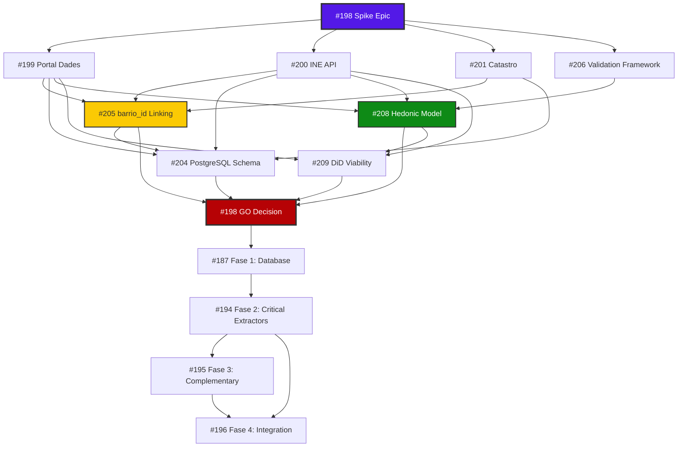
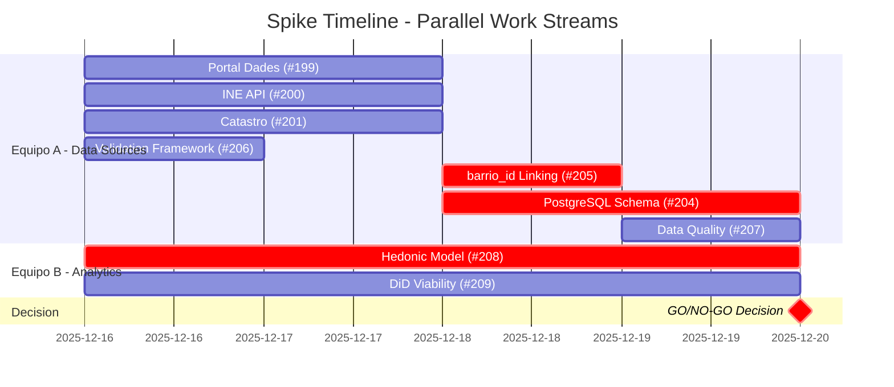
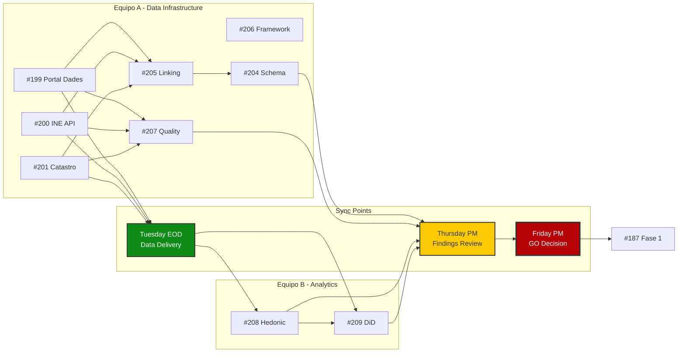
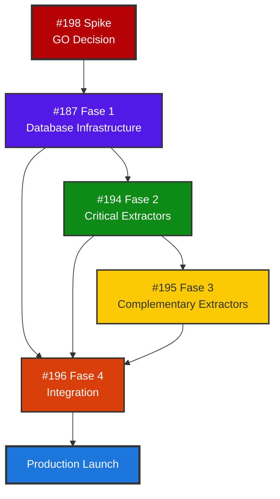

# Spike Dependencies Diagram

**Fecha:** Diciembre 2025  
**Propósito:** Visualización de dependencias y critical path del spike

---

## Critical Path (Must complete in order)

---

## Parallel Work Streams

---

## Team Workflow

---

## Blocking Relationships Matrix

| Issue | Can Start | Blocks | Blocked By |
|-------|-----------|--------|------------|
| #198 | ✅ Monday 9 AM | ALL | None |
| #199 | ✅ Monday 9 AM | #205, #207, #204, #208 | None |
| #200 | ✅ Monday 9 AM | #205, #207, #204, #208 | None |
| #201 | ✅ Monday 9 AM | #205, #207, #204 | None |
| #206 | ✅ Monday 9 AM | #208, #209 (soft) | None |
| #208 | ⚠️ Monday (mock) or Tuesday (real) | #198 (GO) | #199, #200 (soft) |
| #209 | ⚠️ Monday (mock) or Tuesday (real) | #198 (GO) | #208 (soft), #199 |
| #205 | ⚠️ Wednesday AM | #204, #207 | #199, #200, #201 |
| #204 | ⚠️ Wednesday PM | #188, #189, #187 | #199, #200, #201, #205, #208 |
| #207 | ⚠️ Tuesday PM | #198 (GO) | #199, #200, #201 |

---

## Post-Spike Dependencies

---

**Última actualización:** Diciembre 2025

