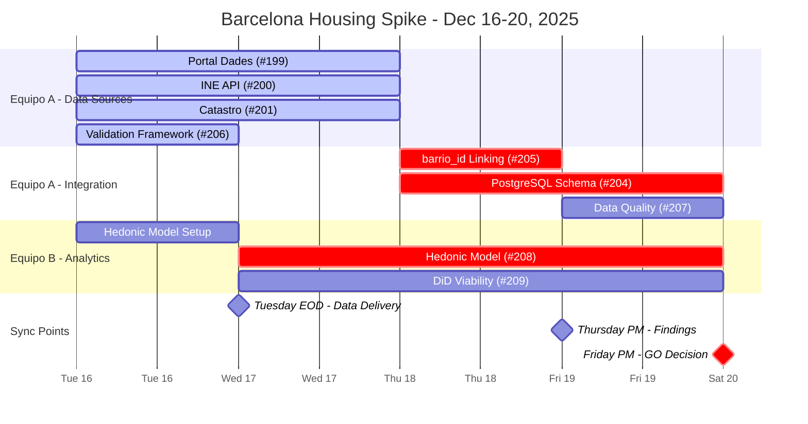
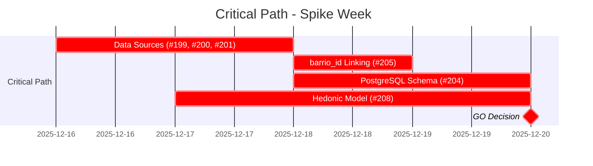

# Spike Gantt Chart - Detailed Timeline

**Fecha:** Diciembre 2025  
**Propósito:** Timeline detallado del spike con dependencias y milestones

---

## Gantt Chart - Spike Week (Dec 16-20, 2025)

---

## Daily Breakdown

### Monday (Dec 16)

**Equipo A:**
- 9:00 AM - Kickoff meeting
- 9:30 AM - Start #199, #200, #201, #206 (parallel)
- 5:00 PM - Daily sync

**Equipo B:**
- 9:00 AM - Kickoff meeting
- 10:00 AM - Start #208 setup (mock data)
- 2:00 PM - Start #209 research
- 5:00 PM - Daily sync

**Deliverables:**
- #206: Validation framework ready (Tuesday AM)

---

### Tuesday (Dec 17)

**Equipo A:**
- 9:00 AM - Continue #199, #200, #201
- 2:00 PM - Prepare sample CSVs for Equipo B
- **5:00 PM - ⚠️ SYNC POINT: Deliver data to Equipo B**

**Equipo B:**
- 9:00 AM - Receive validation framework (#206)
- 10:00 AM - Continue #208 with mock data
- **5:00 PM - ⚠️ SYNC POINT: Receive real data from Equipo A**
- 6:00 PM - Swap mock data for real data in #208

**Deliverables:**
- #199, #200, #201: Sample CSVs (10-20 barrios × variables)
- #206: Framework ready

---

### Wednesday (Dec 18)

**Equipo A:**
- 9:00 AM - Start #205 (barrio_id linking)
- 2:00 PM - Start #204 (PostgreSQL schema - preliminary)
- **5:00 PM - ⚠️ SYNC POINT: Present linking results**

**Equipo B:**
- 9:00 AM - Continue #208 with real data
- 2:00 PM - Continue #209 (DiD assessment)
- 5:00 PM - Daily sync

**Deliverables:**
- #205: Linking results (>90% success rate)
- #204: Preliminary schema design

---

### Thursday (Dec 19)

**Equipo A:**
- 9:00 AM - Continue #204 (incorporate feedback)
- 10:00 AM - Start #207 (Data quality assessment)
- **2:00 PM - ⚠️ SYNC POINT: Present findings**

**Equipo B:**
- 9:00 AM - Finalize #208 (model performance)
- 10:00 AM - Finalize #209 (DiD viability)
- **2:00 PM - ⚠️ SYNC POINT: Present model performance & DiD viability**

**Deliverables:**
- #208: Model performance (R², coefficients)
- #209: DiD viability assessment
- #204: Final schema v2.0
- #207: Data quality scorecard

---

### Friday (Dec 20)

**Equipo A:**
- 9:00 AM - Finalize #207 (if needed)
- 10:00 AM - Prepare final documentation
- 2:00 PM - Final sync

**Equipo B:**
- 9:00 AM - Prepare final recommendations
- 10:00 AM - Finalize viability report
- 2:00 PM - Final sync

**3:00 PM - 🎯 DECISION MEETING:**
- Review all findings
- Evaluate GO/NO-GO criteria
- Make decision: GO / NO-GO / GO with caveats

**Deliverables:**
- Viability report (PDF)
- Decision record
- Updated PRD (if GO)

---

## Critical Path Timeline

---

## Resource Allocation

| Team | Monday | Tuesday | Wednesday | Thursday | Friday | Total |
|------|--------|---------|------------|----------|--------|-------|
| **Equipo A** | 16h | 16h | 16h | 16h | 8h | 72h |
| **Equipo B** | 8h | 8h | 8h | 8h | 4h | 36h |
| **Total** | 24h | 24h | 24h | 24h | 12h | 108h |

**Note:** Total effort is 74h, but with parallel work and sync points, actual calendar time is 5 days.

---

**Última actualización:** Diciembre 2025

