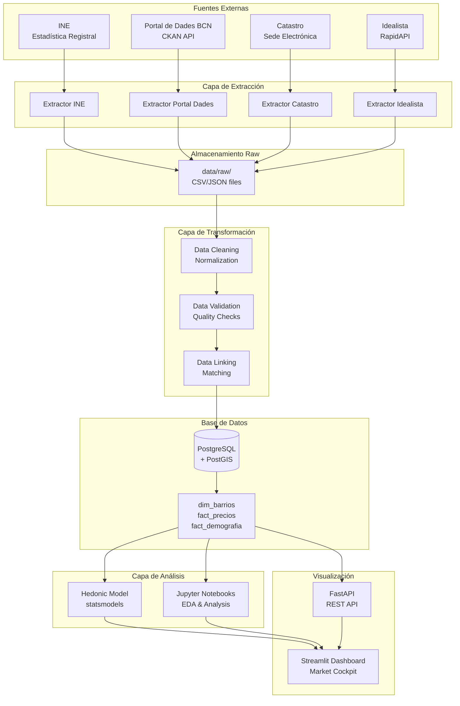
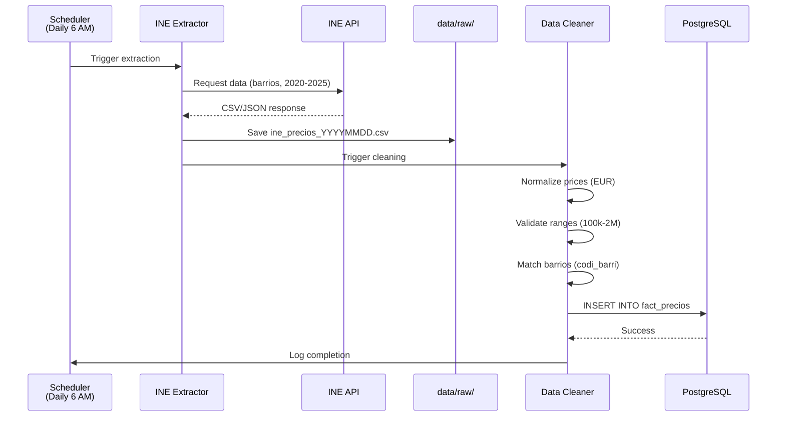
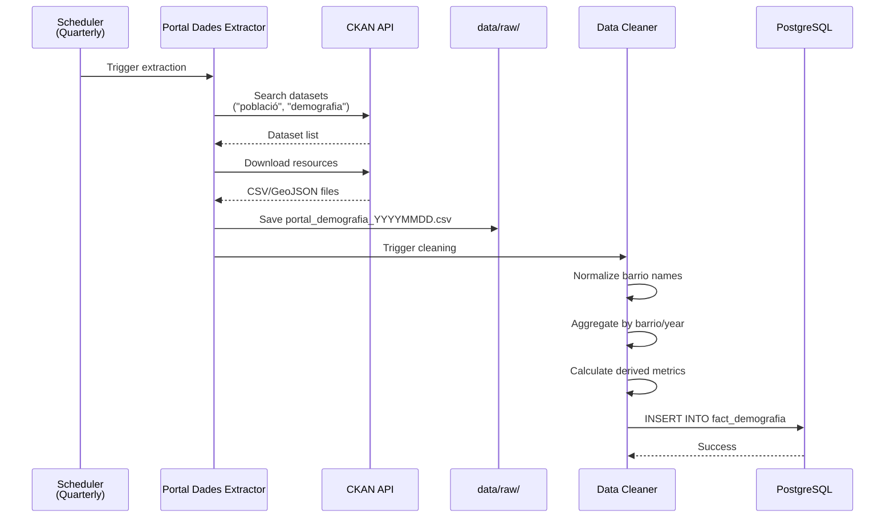
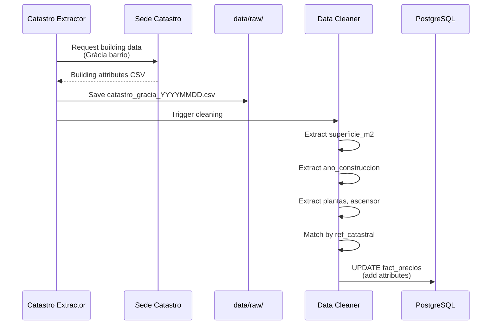
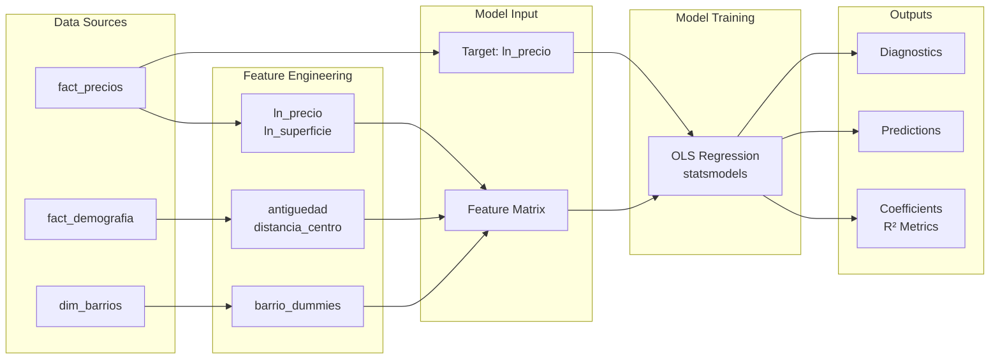
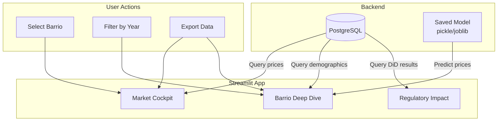
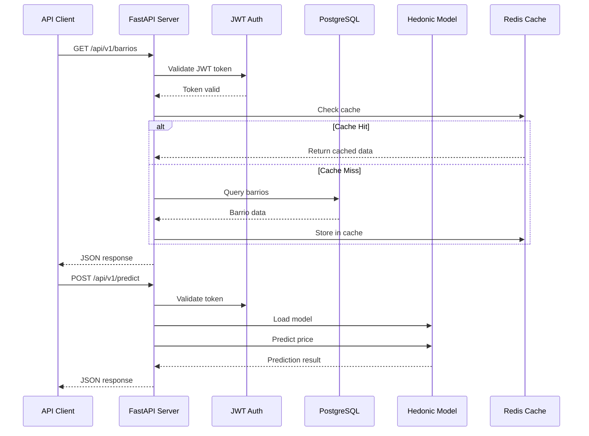

# Data Flow Architecture

**Versión:** 2.0  
**Última actualización:** Diciembre 2025

---

## Resumen

Este documento describe el flujo completo de datos desde las fuentes externas hasta el dashboard final, incluyendo extracción, transformación, carga y visualización.

---

## Diagrama de Flujo General

---

## Flujo Detallado por Fuente

### 1. INE - Precios de Transacciones

**Datos extraídos:**
- Precio por m² de venta
- Precio de alquiler mensual
- Número de transacciones
- Período: Trimestral/Anual

---

### 2. Portal de Dades - Demografía

**Datos extraídos:**
- Población total por barrio
- Estructura de edad
- Composición de hogares
- Población extranjera
- Densidad poblacional

---

### 3. Catastro - Características de Viviendas

**Datos extraídos:**
- Superficie (m²)
- Año de construcción
- Número de plantas
- Presencia de ascensor
- Referencia catastral (para matching)

---

## Pipeline ETL Completo

### Fase 1: Extracción (Extract)

**Objetivo:** Obtener datos de fuentes externas sin modificar

**Proceso:**
1. Identificar fuente y endpoint
2. Autenticación (si requiere)
3. Request de datos con parámetros
4. Descarga de archivos (CSV/JSON/GeoJSON)
5. Guardado en `data/raw/` con timestamp
6. Logging de extracción

**Características:**
- Idempotente (puede ejecutarse múltiples veces)
- Manejo de errores y retry logic
- Rate limiting (respetar límites de APIs)
- Validación básica (archivo no vacío, formato correcto)

---

### Fase 2: Transformación (Transform)

**Objetivo:** Limpiar, normalizar y enriquecer datos

**Procesos:**

1. **Data Cleaning**
   - Eliminar duplicados
   - Manejar valores nulos
   - Normalizar formatos (fechas, precios, nombres)
   - Validar rangos (precios razonables, fechas válidas)

2. **Data Normalization**
   - Normalizar nombres de barrios
   - Estandarizar códigos (codi_barri)
   - Unificar unidades (EUR, m², fechas ISO)

3. **Data Enrichment**
   - Calcular métricas derivadas (densidad, tasas)
   - Agregar geocodificación (si falta)
   - Calcular distancias (al centro, a servicios)

4. **Data Validation**
   - Validar integridad referencial (barrio_id existe)
   - Validar completitud (≥95% campos requeridos)
   - Validar consistencia (rangos, tipos)

---

### Fase 3: Carga (Load)

**Objetivo:** Insertar datos limpios en PostgreSQL

**Proceso:**
1. Conectar a PostgreSQL
2. Validar schema (tablas existen)
3. Iniciar transacción
4. INSERT/UPDATE datos
5. Validar constraints
6. Commit o Rollback
7. Logging de carga

**Características:**
- Transaccional (todo o nada)
- Upsert logic (INSERT ... ON CONFLICT UPDATE)
- Batch inserts para performance
- Validación post-carga (conteo de registros)

---

## Flujo de Datos para Modelo Hedónico

---

## Flujo de Datos para Dashboard

---

## Flujo de Datos para API

---

## Referencias

- **ETL Pipeline:** `docs/architecture/ETL_PIPELINE.md`
- **Database Schema:** `docs/architecture/DATABASE_SCHEMA_V2.md`
- **Model Specification:** `docs/modeling/MODEL_SPECIFICATION_V2.md`

---

**Última actualización:** Diciembre 2025

