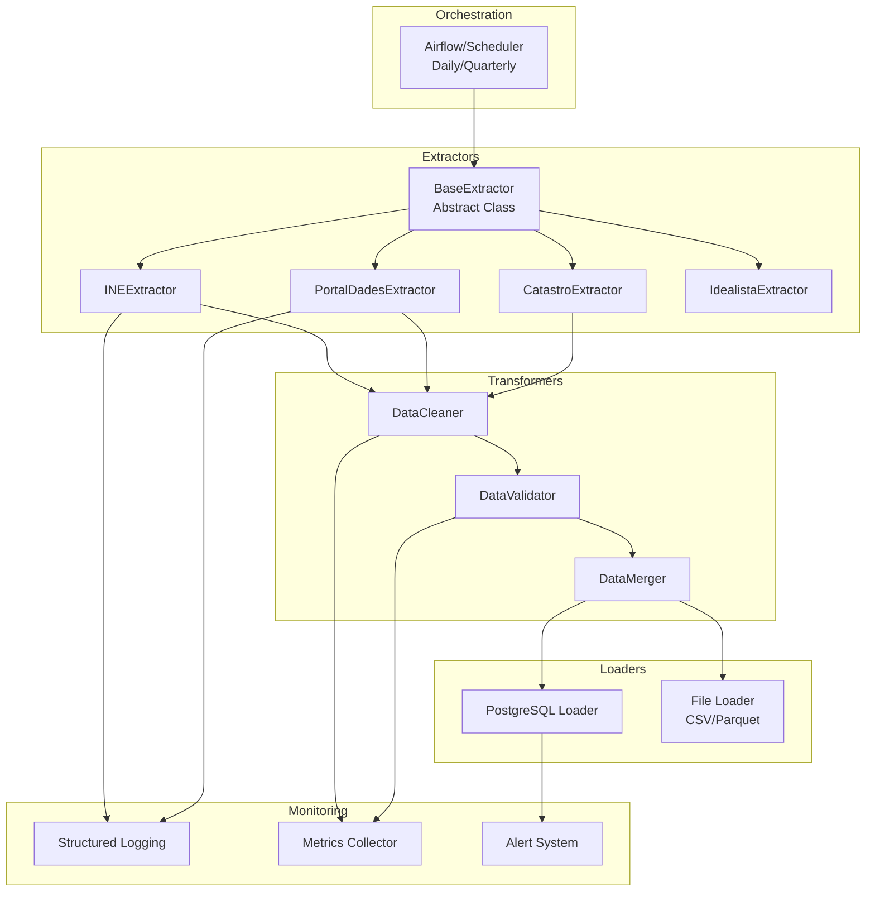

# ETL Pipeline Architecture

**Versión:** 2.0  
**Última actualización:** Diciembre 2025

---

## Resumen

Arquitectura del pipeline ETL (Extract, Transform, Load) para Barcelona Housing Demographics Analyzer. El pipeline es modular, extensible y diseñado para múltiples fuentes de datos.

---

## Arquitectura General



---

## Componentes Principales

### 1. BaseExtractor (Abstract Class)

**Ubicación:** `src/extraction/base.py`

**Responsabilidades:**
- Setup de logging estructurado
- Manejo de errores común
- Retry logic
- Rate limiting
- Validación básica de respuestas

**Interfaz:**

```python
from abc import ABC, abstractmethod

class BaseExtractor(ABC):
    def __init__(self, config: dict):
        self.config = config
        self.logger = setup_logging(self.__class__.__name__)
    
    @abstractmethod
    def extract(self, **kwargs) -> pd.DataFrame:
        """Extraer datos de la fuente"""
        pass
    
    def validate_response(self, response) -> bool:
        """Validar respuesta de API"""
        pass
    
    def save_raw(self, df: pd.DataFrame, filename: str):
        """Guardar datos raw"""
        pass
```

---

### 2. Extractors Específicos

#### INEExtractor

**Fuente:** INE - Estadística Registral Inmobiliaria

**Método de acceso:**
- Web scraping (fallback)
- CSV download (preferido)
- API (si disponible)

**Datos extraídos:**
- Precio por m² de venta
- Precio de alquiler mensual
- Número de transacciones
- Período: Trimestral

**Ejemplo:**

```python
class INEExtractor(BaseExtractor):
    def extract(self, barrios: List[str], year_start: int, year_end: int) -> pd.DataFrame:
        """Extraer precios de INE"""
        # Implementación
        pass
```

#### PortalDadesExtractor

**Fuente:** Portal de Dades BCN (CKAN API)

**Método de acceso:**
- CKAN API v3
- Rate limit: 10 req/sec

**Datos extraídos:**
- Población por barrio
- Estructura de edad
- Composición de hogares
- Población extranjera

**Ejemplo:**

```python
class PortalDadesExtractor(BaseExtractor):
    def __init__(self, config: dict):
        super().__init__(config)
        self.ckan_url = "https://opendata-ajuntament.barcelona.cat/data/api/3"
    
    def extract(self, dataset_id: str) -> pd.DataFrame:
        """Extraer dataset de CKAN"""
        # Implementación con requests
        pass
```

---

### 3. DataCleaner

**Ubicación:** `src/transform/cleaners.py`

**Responsabilidades:**
- Normalización de nombres
- Limpieza de valores nulos
- Validación de rangos
- Conversión de tipos

**Ejemplo:**

```python
class HousingCleaner:
    def clean_price_data(self, df: pd.DataFrame) -> pd.DataFrame:
        """Limpiar datos de precios"""
        df_clean = df.copy()
        
        # Normalizar precios a EUR
        df_clean['precio'] = df_clean['precio'].apply(self._normalize_currency)
        
        # Validar rangos
        df_clean = df_clean[
            (df_clean['precio'] >= 100000) & 
            (df_clean['precio'] <= 2000000)
        ]
        
        # Eliminar duplicados
        df_clean = df_clean.drop_duplicates(subset=['barrio_id', 'fecha'])
        
        return df_clean
```

---

### 4. DataValidator

**Ubicación:** `src/transform/validators.py`

**Responsabilidades:**
- Validar integridad referencial
- Validar completitud
- Validar consistencia
- Generar reportes de calidad

**Ejemplo:**

```python
class DataValidator:
    def validate_completeness(self, df: pd.DataFrame, threshold: float = 0.95) -> bool:
        """Validar completitud de datos"""
        completeness = df.notna().sum() / len(df)
        return (completeness >= threshold).all()
    
    def validate_referential_integrity(self, df: pd.DataFrame, barrios: pd.DataFrame) -> bool:
        """Validar que barrio_id existe en dim_barrios"""
        valid_barrios = set(barrios['barrio_id'])
        return df['barrio_id'].isin(valid_barrios).all()
```

---

### 5. DataMerger

**Ubicación:** `src/transform/mergers.py`

**Responsabilidades:**
- Matching de datasets
- Merge por referencia catastral
- Fuzzy matching de direcciones
- Agregación a nivel barrio-mes (fallback)

**Ejemplo:**

```python
class DataMerger:
    def merge_by_ref_catastral(self, df_precios: pd.DataFrame, df_atributos: pd.DataFrame) -> pd.DataFrame:
        """Merge por referencia catastral"""
        merged = df_precios.merge(
            df_atributos,
            on='ref_catastral',
            how='inner'
        )
        return merged
    
    def merge_by_fuzzy_address(self, df_precios: pd.DataFrame, df_atributos: pd.DataFrame, threshold: int = 85) -> pd.DataFrame:
        """Merge por dirección con fuzzy matching"""
        # Implementación con fuzzywuzzy
        pass
```

---

## Pipeline Orchestration

### Opción 1: Python Scripts + Cron

**Archivo:** `scripts/run_etl.py`

```python
#!/usr/bin/env python3
"""ETL Pipeline Orchestrator"""

from src.extraction.ine import INEExtractor
from src.extraction.portal_dades import PortalDadesExtractor
from src.transform.cleaners import HousingCleaner
from src.transform.validators import DataValidator
from src.load.postgres import PostgresLoader

def run_etl():
    # Extract
    ine_extractor = INEExtractor(config)
    df_precios = ine_extractor.extract(barrios=['Gràcia'], year_start=2020, year_end=2025)
    
    portal_extractor = PortalDadesExtractor(config)
    df_demografia = portal_extractor.extract(dataset_id='demografia-barris')
    
    # Transform
    cleaner = HousingCleaner()
    df_precios_clean = cleaner.clean_price_data(df_precios)
    
    validator = DataValidator()
    if not validator.validate_completeness(df_precios_clean):
        raise ValueError("Data completeness below threshold")
    
    # Load
    loader = PostgresLoader(config)
    loader.load_precios(df_precios_clean)
    loader.load_demografia(df_demografia)
    
    print("✅ ETL completed successfully")

if __name__ == "__main__":
    run_etl()
```

**Cron schedule:**
```bash
# Daily at 6 AM
0 6 * * * /path/to/venv/bin/python /path/to/scripts/run_etl.py
```

---

### Opción 2: Apache Airflow (v2.1+)

**DAG Definition:**

```python
from airflow import DAG
from airflow.operators.python import PythonOperator
from datetime import datetime, timedelta

default_args = {
    'owner': 'data-engineering',
    'depends_on_past': False,
    'start_date': datetime(2026, 1, 1),
    'retries': 3,
    'retry_delay': timedelta(minutes=5),
}

dag = DAG(
    'barcelona_housing_etl',
    default_args=default_args,
    description='ETL Pipeline for Barcelona Housing Data',
    schedule_interval='0 6 * * *',  # Daily at 6 AM
    catchup=False,
)

extract_ine = PythonOperator(
    task_id='extract_ine',
    python_callable=extract_ine_data,
    dag=dag,
)

extract_portal = PythonOperator(
    task_id='extract_portal_dades',
    python_callable=extract_portal_dades_data,
    dag=dag,
)

transform_data = PythonOperator(
    task_id='transform_data',
    python_callable=transform_data,
    dag=dag,
)

load_postgres = PythonOperator(
    task_id='load_postgres',
    python_callable=load_to_postgres,
    dag=dag,
)

extract_ine >> transform_data >> load_postgres
extract_portal >> transform_data >> load_postgres
```

---

## Error Handling y Retry Logic

### Retry Strategy

```python
from tenacity import retry, stop_after_attempt, wait_exponential

@retry(
    stop=stop_after_attempt(3),
    wait=wait_exponential(multiplier=1, min=4, max=10)
)
def extract_with_retry(extractor, **kwargs):
    """Extraer con retry automático"""
    try:
        return extractor.extract(**kwargs)
    except requests.exceptions.RequestException as e:
        logger.warning(f"Retry attempt failed: {e}")
        raise
```

### Error Notification

```python
def notify_error(error: Exception, context: dict):
    """Notificar errores críticos"""
    # Enviar a Slack/Discord
    # Crear issue en GitHub
    # Enviar email
    pass
```

---

## Monitoring y Logging

### Structured Logging

```python
import logging
import json
from datetime import datetime

def setup_logging(name: str) -> logging.Logger:
    logger = logging.getLogger(name)
    logger.setLevel(logging.INFO)
    
    handler = logging.FileHandler(f'data/logs/{name}_{datetime.now().strftime("%Y%m%d")}.log')
    formatter = logging.Formatter(
        '{"timestamp": "%(asctime)s", "level": "%(levelname)s", "message": "%(message)s"}'
    )
    handler.setFormatter(formatter)
    logger.addHandler(handler)
    
    return logger
```

### Metrics Collection

```python
def collect_metrics(extractor_name: str, records: int, duration: float):
    """Recopilar métricas de extracción"""
    metrics = {
        'extractor': extractor_name,
        'records': records,
        'duration_seconds': duration,
        'records_per_second': records / duration,
        'timestamp': datetime.now().isoformat()
    }
    # Enviar a Prometheus/Grafana
    # O guardar en base de datos
    return metrics
```

---

## Referencias

- **Data Flow:** `docs/architecture/DATA_FLOW.md`
- **Database Schema:** `docs/architecture/DATABASE_SCHEMA_V2.md`
- **Extractors:** `src/extraction/`

---

**Última actualización:** Diciembre 2025

