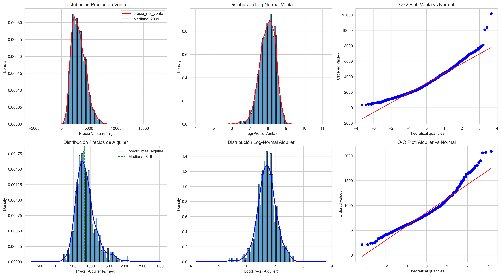
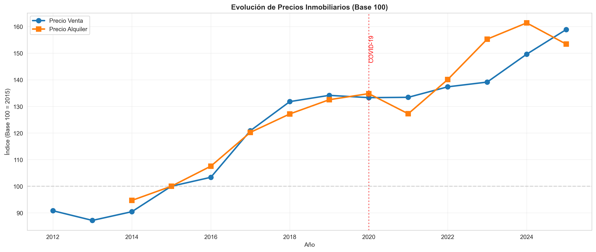
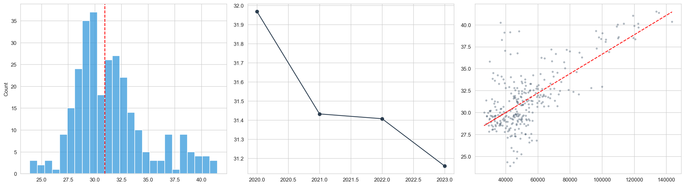
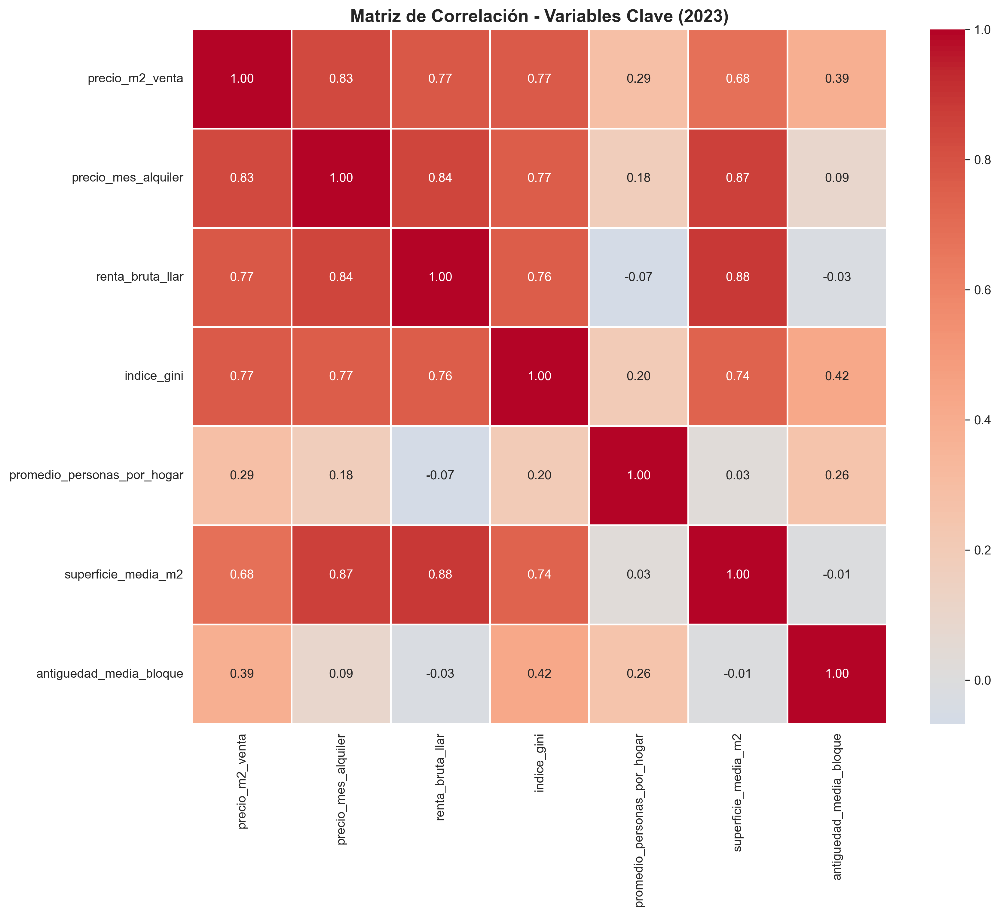

# 📊 Informe Ejecutivo: EDA del Mercado Inmobiliario - Barcelona
**Generado el:** 28/12/2025 12:54

---

## 🔍 1. Conclusiones Principales del Análisis

### 💵 Dinámicas de Precios
- **Distribución:** Confirmamos que los precios siguen una **curva Log-Normal**. 
  *   *Implicación:* Para el modelado predictivo (ML), debemos aplicar `log1p` a las variables de precio para estabilizar la varianza.
- **Efecto Inflación:** Los precios de alquiler han superado el crecimiento del IPC post-COVID (+3.4pp), mientras que la venta se ha quedado rezagada (-6.9pp).
- **Rentabilidad (Yield):** La rentabilidad bruta media es del **5.0%**. Los barrios de menor renta ofrecen mayores rendimientos, sugiriendo una prima de riesgo por inversión en periferia.

### 📉 Factores Socio-Económicos
- **Renta vs Precio:** Existe una correlación lineal fuerte ($r > 0.8$) entre la renta media del hogar y el precio de venta.
- **Inequidad (Gini):** Barcelona mantiene una inequidad moderada (~31.5). No se observa una correlación directa fuerte entre la desigualdad interna del barrio y el precio del m2, lo que sugiere que el mercado inmobiliario se mueve por factores de demanda externa o conectividad.

---

## 🖼️ 2. Visualizaciones Críticas Consolidadas

| Análisis | Resultado Clave |
| :--- | :--- |
| **Distribución** |  |
| **Evolución** |  |
| **Inequidad** |  |
| **Correlación** |  |

---

## 🚀 3. Hoja de Ruta: Próximos Pasos (Fase 2)

Basado en los hallazgos de este EDA, la estrategia recomendada es:

1.  **Ingeniería de Características (Feature Engineering):**
    *   Generar una métrica de "Accesibilidad" (`Renta / Precio Alquiler`).
    *   Añadir variables de "Distancia al Centro" y "Densidad Comercial".
2.  **Modelado Predictivo:**
    *   Entrenar un **Gradient Boosting Regressor (XGBoost/LightGBM)** para predecir precios.
    *   Usar el Índice de Gini y el ratio P80/P20 como variables de control para capturar segmentación social.
3.  **Clustering de Barrios:**
    *   Identificar grupos de barrios con comportamientos atípicos (ej. baja renta pero alto crecimiento de precio) para detectar zonas con riesgo de gentrificación.

---
**Status:** ✅ EDA Completado | 🛠️ Listo para Feature Engineering
